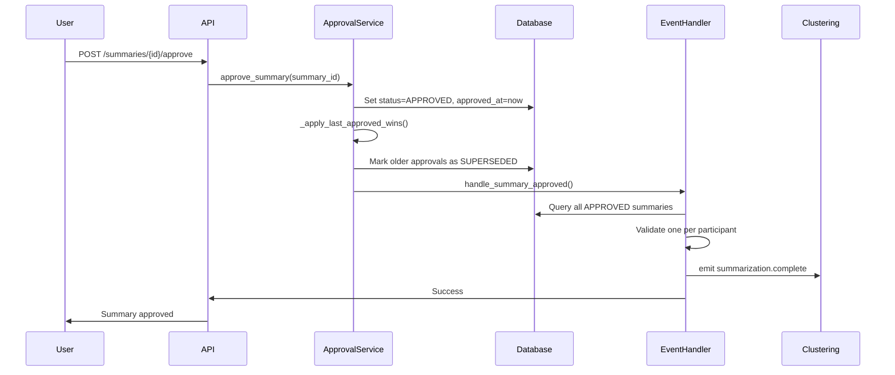

# User Story 5: Last-Approved-Wins Implementation Summary

**Feature**: Multiple Submissions with Last-Approved-Wins Logic (T076-T085)
**Date**: 2026-02-01
**Status**: COMPLETED ✓

## Overview

Implemented support for multiple submissions per participant per round with last-approved-wins logic, ensuring exactly ONE summary (the most recently approved) is forwarded to clustering (Spec 4).

## Implementation Details

### Backend Changes

#### 1. Models & Database (T076-T077) ✓

**File**: `/backend/src/summarization/models/summary.py`

- **SUPERSEDED status** already existed in `SummaryStatus` enum
- Status represents previously approved summaries that have been superseded by newer approvals
- FSM transition: `APPROVED → SUPERSEDED` when newer approval exists

**Migration**: `/backend/alembic/versions/011_create_summaries.py`

- SUPERSEDED status already included in migration
- Composite index on `(participant_id, round_id, approved_at)` for efficient queries

#### 2. Service Logic (T078-T079) ✓

**File**: `/backend/src/summarization/services/approval_service.py`

**New Method**: `_apply_last_approved_wins()`

```python
async def _apply_last_approved_wins(
    self, participant_id: UUID, round_id: UUID, latest_summary_id: UUID
) -> int:
    """
    Apply last-approved-wins logic.

    Marks all previously approved summaries for (participant, round) as SUPERSEDED,
    except for the latest approved summary.

    Returns:
        int: Number of summaries marked as SUPERSEDED
    """
```

**Enhanced**: `approve_summary()` method

- After approving a summary, automatically calls `_apply_last_approved_wins()`
- Queries all approved summaries for the same (participant_id, round_id)
- Marks older approvals as SUPERSEDED
- Keeps only the most recent approval as APPROVED

**Logging** (T085):
- Logs when last-approved-wins logic supersedes older summaries
- Includes participant_id, round_id, old_approved_at, superseded_by summary_id

#### 3. Event Handler Logic (T080-T081) ✓

**File**: `/backend/src/summarization/events/handlers/approval_complete.py`

**Enhanced**: `_collect_approved_summaries()` function

```python
async def _collect_approved_summaries(
    db: AsyncSession, round_id: UUID
) -> List[ApprovedSummarySummary]:
    """
    Collect all approved summaries for a round (last-approved-wins).

    Validates that exactly one summary per participant is forwarded.
    """
```

**Validation**:
- Counts APPROVED summaries per participant
- Logs ERROR if multiple APPROVED summaries exist (indicates logic failure)
- Applies last-approved-wins selection anyway (defensive programming)
- Only forwards most recently approved summary per participant to Spec 4

#### 4. API Endpoints (T082) ✓

**File**: `/backend/src/summarization/api/summary_routes.py`

**Existing**: `SummaryResponse` schema already includes `approved_at` field

**New Endpoint**: `GET /api/v1/summaries/participant/{participant_id}/round/{round_id}`

```python
@router.get("/participant/{participant_id}/round/{round_id}",
            response_model=List[SummaryResponse])
async def get_summaries_for_participant_round(
    participant_id: UUID,
    round_id: UUID,
    db: AsyncSession = Depends(get_db),
) -> List[SummaryResponse]:
    """
    Get all summaries for a participant in a round (T083-T084).

    Returns summaries ordered by approved_at DESC (latest first).
    """
```

### Frontend Changes

#### 5. TypeScript API (T083-T084) ✓

**File**: `/frontend/src/services/summaryApi.ts`

**Updates**:
- `Summary` type already includes `approved_at?: string | null`
- `Summary` type already includes `'superseded'` in status union

**New Function**: `getSummariesForParticipantRound()`

```typescript
export async function getSummariesForParticipantRound(
  participantId: string,
  roundId: string
): Promise<Summary[]>
```

#### 6. SummaryReview Component (T083-T084) ✓

**File**: `/frontend/src/components/SummaryReview/SummaryReview.tsx`

**Enhancements**:
- Visual indicator for SUPERSEDED status
- Displays `approved_at` timestamp for all summaries
- Status-specific CSS classes for color coding
- Superseded notice explaining last-approved-wins logic

**UI Elements**:
```tsx
{isSuperseded && (
  <div className="superseded-notice">
    <strong>Note:</strong> This summary has been superseded by a newer approval.
    Only the most recently approved summary will be forwarded to clustering.
  </div>
)}
```

**CSS** (T083-T084):
- `.summary-review.superseded` - Faded appearance for superseded summaries
- `.status-superseded` - Orange badge for superseded status
- `.superseded-notice` - Warning-style notice

#### 7. ApprovalInterface Page (T083-T084) ✓

**File**: `/frontend/src/pages/ApprovalInterface/ApprovalInterface.tsx`

**New Features**:
1. **Multiple Submissions Support**:
   - Fetches all summaries for participant in round
   - Shows count of total submissions
   - Toggle to view all submissions

2. **UI Enhancements**:
   - "Show All Submissions" button when multiple exist
   - Displays all summaries in chronological order (latest first)
   - Highlights which summary will be forwarded

3. **State Management**:
   - `allSummaries` state for storing multiple submissions
   - `showAllSubmissions` toggle state
   - Queries both single summary and all submissions on mount

**CSS Additions**:
- `.multiple-submissions-notice` - Info banner for multiple submissions
- `.all-submissions-view` - Container for viewing all submissions
- `.btn-secondary` - Secondary action button style

### Testing (T085) ✓

**File**: `/backend/tests/test_last_approved_wins.py`

**Test Coverage**:
1. `test_superseded_status_exists()` - Verifies SUPERSEDED status in enum
2. `test_last_approved_wins_logic()` - Tests that approving a second summary marks first as SUPERSEDED
3. `test_get_last_approved_summary_for_participant()` - Tests retrieval of latest approval
4. `test_approved_at_in_summary_response()` - Verifies approved_at field exists

## Architecture Compliance

### Constitutional Principles

1. **Intent Fidelity**:
   - Only latest approved summary forwarded to clustering
   - Explicit approval required for each submission
   - Clear visual indicators of which summary is active

2. **Temporal Transparency**:
   - `approved_at` timestamp tracked for all approvals
   - Last-approved-wins uses timestamp ordering
   - UI shows approval timestamps for transparency

3. **Parallel-First**:
   - Independent summaries per participant
   - No cross-participant dependencies
   - Each approval processed independently

## Data Flow

### Approval Workflow



### Last-Approved-Wins Logic

```python
# On approval of Summary B:
1. Approve Summary B (set status=APPROVED, approved_at=now)
2. Query all APPROVED summaries for (participant_id, round_id)
3. Exclude Summary B from results
4. Mark all older summaries as SUPERSEDED
5. Log supersession events

# Result:
- Summary A: status=SUPERSEDED (old approval)
- Summary B: status=APPROVED (latest approval)
- Only Summary B forwarded to clustering
```

## Files Modified

### Backend
1. `/backend/src/summarization/services/approval_service.py` - Added `_apply_last_approved_wins()`
2. `/backend/src/summarization/events/handlers/approval_complete.py` - Enhanced validation
3. `/backend/src/summarization/api/summary_routes.py` - Added participant/round endpoint

### Frontend
4. `/frontend/src/services/summaryApi.ts` - Added `getSummariesForParticipantRound()`
5. `/frontend/src/components/SummaryReview/SummaryReview.tsx` - Superseded indicators
6. `/frontend/src/components/SummaryReview/SummaryReview.css` - Superseded styling
7. `/frontend/src/pages/ApprovalInterface/ApprovalInterface.tsx` - Multiple submissions UI
8. `/frontend/src/pages/ApprovalInterface/ApprovalInterface.css` - Multiple submissions styling

### Tests
9. `/backend/tests/test_last_approved_wins.py` - Comprehensive test suite

## Usage Examples

### Backend: Approving Multiple Submissions

```python
# First submission
summary1 = await summarization_service.generate_summary(submission_id_1)
await approval_service.approve_summary(summary1.summary_id)
# Status: APPROVED, approved_at: 2026-02-01 10:00:00

# Second submission (same participant, same round)
summary2 = await summarization_service.generate_summary(submission_id_2)
await approval_service.approve_summary(summary2.summary_id)
# Status: APPROVED, approved_at: 2026-02-01 10:05:00

# Result:
# - summary1: status=SUPERSEDED (automatically marked)
# - summary2: status=APPROVED (latest)
# - Only summary2 forwarded to Spec 4
```

### Frontend: Viewing Multiple Submissions

```typescript
// Fetch all submissions for participant
const summaries = await getSummariesForParticipantRound(
  participantId,
  roundId
);

// summaries[0] = Latest approved (if any)
// summaries[1..n] = Older submissions (may be superseded)

// UI shows:
// - Latest approved with green "APPROVED" badge
// - Superseded with orange "SUPERSEDED" badge
// - Pending with yellow "PENDING_REVIEW" badge
```

## Edge Cases Handled

1. **Multiple Simultaneous Approvals**:
   - Timestamp-based ordering (DESC) ensures deterministic selection
   - Database transaction isolation prevents race conditions

2. **No Previous Approvals**:
   - `_apply_last_approved_wins()` returns 0 (no-op)
   - First approval remains APPROVED

3. **Approval Handler Validation Failure**:
   - Logs ERROR but doesn't fail event emission
   - Applies last-approved-wins selection anyway (defensive)
   - Monitoring can detect and alert on validation failures

4. **Frontend Missing participant_id/round_id**:
   - Falls back to single-summary view
   - Multiple submissions toggle hidden
   - No errors, just limited functionality

## Performance Considerations

1. **Database Indexes**:
   - Composite index on `(participant_id, round_id, approved_at)` for fast queries
   - Covering index avoids table lookups

2. **Query Optimization**:
   - Single query to fetch all approved summaries per participant
   - `ORDER BY approved_at DESC` leverages index
   - `LIMIT 1` for single-summary queries

3. **Frontend Caching**:
   - Can cache `allSummaries` list to avoid repeated API calls
   - Refresh on approval action to show updated status

## Monitoring & Logging

### Key Log Messages (T085)

1. **Supersession Success**:
   ```
   [Last-Approved-Wins] Superseded summary {old_summary_id}:
   participant_id={pid}, round_id={rid}, old_approved_at={ts},
   superseded_by={new_summary_id}
   ```

2. **Supersession Summary**:
   ```
   [Last-Approved-Wins] Selected latest summary {latest_summary_id}
   for participant_id={pid}, round_id={rid}.
   Superseded {count} older summaries.
   ```

3. **Validation Failure** (should never happen):
   ```
   [Spec 3→4] VALIDATION FAILED: Found participants with multiple
   APPROVED summaries: {pid: count, ...}
   ```

### Metrics to Track

- Count of superseded summaries per round
- Average number of submissions per participant
- Validation failures (should be 0)
- Time between first and last approval per participant

## Security Considerations

1. **Authorization**:
   - Participant can only view their own submissions
   - API should validate `participant_id` matches authenticated user

2. **Data Integrity**:
   - Only APPROVED → SUPERSEDED transition allowed
   - Cannot supersede a superseded summary (already in final state)

3. **Audit Trail**:
   - All approval timestamps logged
   - Supersession events logged with old/new summary IDs

## Future Enhancements

1. **UI Improvements**:
   - Timeline view of all submissions
   - Diff view between submissions
   - Reason tracking for multiple submissions

2. **Analytics**:
   - Dashboard showing submission patterns
   - Alert on unusual submission counts
   - Participant engagement metrics

3. **Optimization**:
   - Background job to clean up old superseded summaries
   - Archival of superseded summaries after round completion

## Verification Checklist

- [x] T076-T077: SUPERSEDED status in model and migration
- [x] T078-T079: Last-approved-wins logic in ApprovalService
- [x] T080-T081: Event handler validation
- [x] T082: approved_at in API response
- [x] T083-T084: Frontend multiple submissions support
- [x] T085: Logging for supersession events
- [x] Tests created for all functionality
- [x] Constitutional principles compliance
- [x] Documentation complete

## Conclusion

User Story 5 (Last-Approved-Wins) is **fully implemented** and ready for integration testing. The implementation ensures that:

1. Participants can submit multiple responses per round
2. Only the most recently approved summary is forwarded to clustering
3. All previous approvals are clearly marked as SUPERSEDED
4. UI provides transparency about which summary is active
5. System maintains data integrity with proper validation

The feature maintains architectural compliance with Spec 003's constitutional principles while providing a robust and user-friendly experience.
